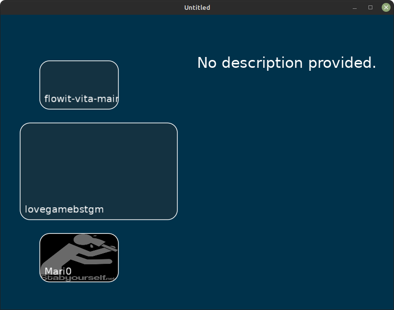

# Love Loader

Custom menu for selecting game from multiple for Love2D.

Works from Love2D 0.10.



[Other screenshots](./scr)

# How it works?

Just place games into `games` folder! (like `this_folder/games/game/main.lua`)

Technically, this creates the loop until game wasn't selected or user wants to exit,
with custom event handling and redrawing.

# LibLL

Love Loader from 2.0 includes backend API to simplify creating custom skins.

It have not so many functions and fields:

```lua
ll.games = { -- field for games with structure below
  {
    name = 'string', -- Friendly name for game or placeholder
    desc = 'string', -- Description for game or placeholder
    base = 'string', -- base directory used in game mounting, must end with `/`
    dir  = 'string', -- directory name, used if no name was defined
    main = 'string', -- main file to execute or `main.lua`
    screens = {'array of', 'path to screenshots'},
    scrcur  = 1, --[[number]] -- current  index from screenshots
    scrprv  = 1, --[[number]] -- previous index from screenshots
    dat = nil, --[[any]] -- maybe platform-dependent data to reduce operations
  }
}

ll.mdir -- string or nil, contains full mounted directory.
ll.mgme -- game or nil, contains mounted game

-- check if game mounted by ll.mdir!

function ll.gameNew(
  configuration, --string
  fileName, -- string, not used
  baseDirectory, -- string
  gameDirectory -- string
) -- creates game object (defined above) and returns it.

function ll.gameAdd(...) -- same as ll.gameNew with insertion into ll.games.

function ll.addGame(fileName, fileContent) -- reserved function for file dropping.

function ll.mount(gameObject) -- mounts game.
  -- throws error.
  -- Sets ll.mdir and ll.mgme

function ll.umount() -- unmounts game if was mounted.
  -- Unsets ll.mdir and ll.mgme

ll.home = llHome

function ll.devtools() -- enable developer tools.

if ll.dt then -- is developer tools enabled?
  __LL = ll -- global variable with Love Loader instance.
end

function ll.fsIsAbs(file) -- is file absolute? (/file)

function ll.fsIsRel(file) -- is file relative? (./file)
  -- return not ll.fsIsAbs(file)

function ll.fsDir(path) -- get directory name (2 from /1/2/3.file)

function ll.fsFile(path) -- get file (including dividers after) (2 from /1/2)

function ll.kbInit(
  direction, -- string: '*', 'h', 'v', 'x', 'y'
  c1, -- number, coordinate before card (for mouse) (left/top)
  c2, -- number, coordinate after card (for mouse) (right/bottom)
  clim -- number = -1, other coordinate limit (for mouse) (x for v, y for h), -1 to disable
) -- initialize keyboard module (inside skins).

function ll.kbGet() -- get key pressed.
  -- need ll.kbInit(...) before
  -- returns nil | string: '<', '>', 'o', 'm', ('^', 'v' if direction == '*')

```

# API

To reduce things to do for game developers, this loader creates some global variables to use.

You can also use it without Love Loader (or if your game can distribute without loader)
using `require 'll-min'`

```lua
W, H = width, height -- of the screen.

function love.resize() -- internal function that updates W, H and calls resize function if exists.

function resize() -- payload for love.resize function.

function love.event.quit() -- *should* exit to Love Loader screen.

function llHome() -- function called by love.event.quit.

llUsed = false -- is Love Loader (not minimal API) used.

COLDIV = 1 -- or 255, color divider for love.graphics.setColor function (150/COLDIV).

MOBILE = false -- is this device runs Android or iOS?
```

# Fill game information

To fill game information in game folder need to create `info.ll` file.

Syntax is `k = v` with `# comments`

```
# are there needed any comments?
name = New awesome game using Love Loader
desc = Some descripion about the game.
# main = optional main file instead of `main.lua`
pic = screen.png
pics = [ screen.png; screen2.png ] # wow arrays
```

